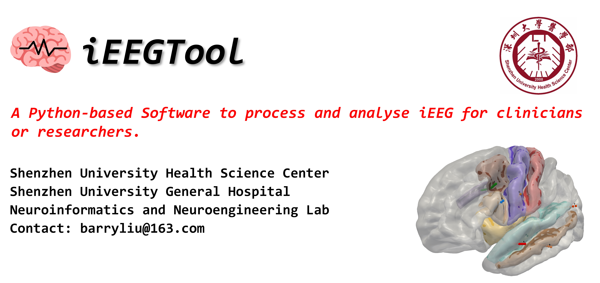

# 🧠 iEEGTool



> *A Python-based Software to process and analyse iEEG for clinicians or researchers*

## 🔆Highlights

- Full pipeline of iEEG process and analysis in epilepsy.
- Localization of iEEG electrodes.
- Electrodes related regions of interest visualization.
- Biomarker analysis to locate Epileptogenic Zone.

## 👁️‍🗨️ Overview

A Python-based Software for processing and analyzing pipeline of iEEG, containing basic __T1-MRI and CT processing__ , __Freesurfer reconstruction__, __Regions of interest mapping and visualization__, __SEEG processing__ and __Biomarker analysis__.

## ✍️ Author

Hi, This is NINE Lab. We created this project hoping to design a Python-based, easy-used Tool to process and analyze iEEG for clinicians or researchers.

## 🖥️ Installation

```bash
git clone https://github.com/BarryLiu97/iEEGTool.git
conda create -n ieeg python=3.8
conda activate ieeg
cd iEEGTool
pip install -r requirements.txt
```

## 🗝️ Usage

```bash
cd iEEGTool
python main.py
```

## 🚴 Contributors

[ZhengLiu](https://github.com/ZhengLiu97)  
